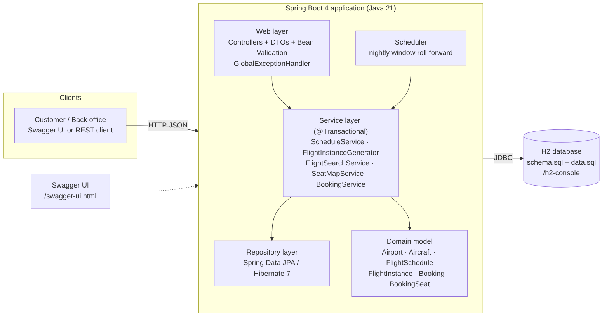
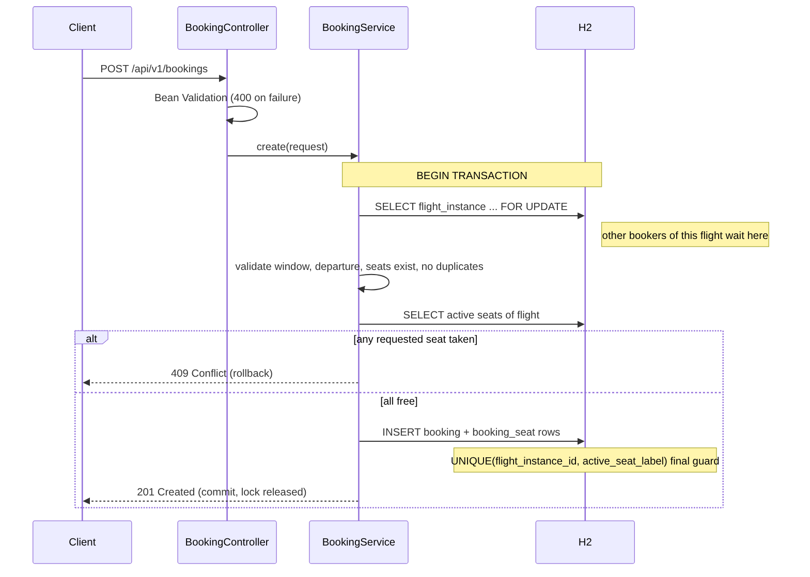
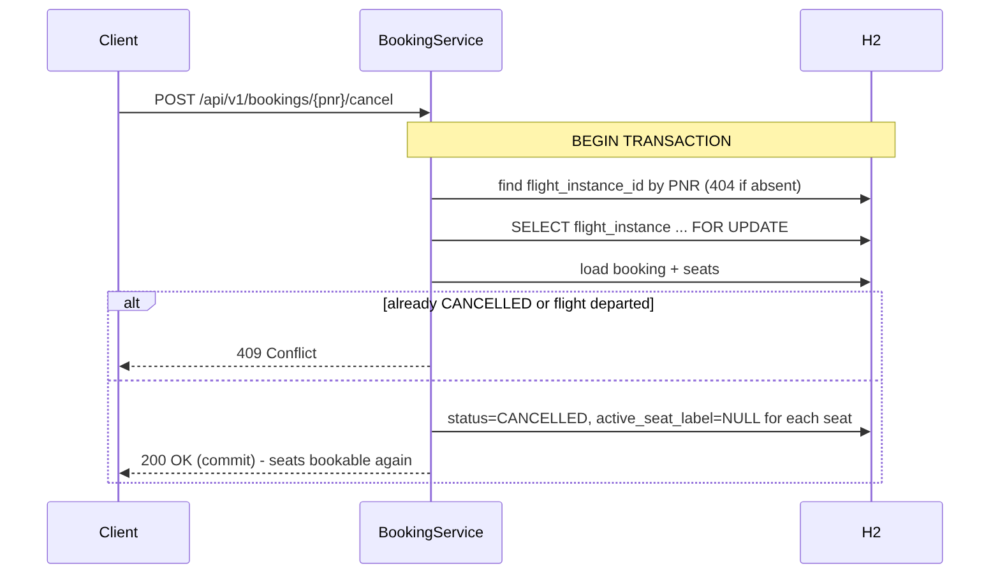
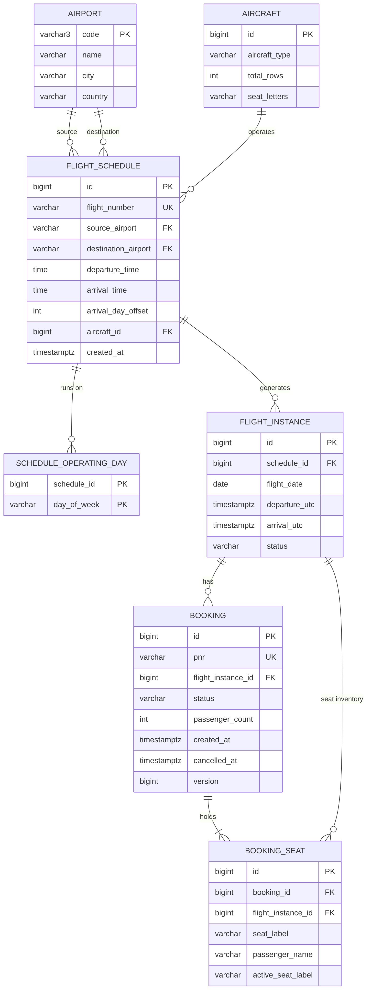

# Airline Ticketing System - High-Level Design

## 1. Overview and architecture
A single Spring Boot 4 (Java 21) service exposing a REST API, backed by an H2 relational database. Customers and
back-office users call the same API (authentication is out of scope). Swagger UI documents and exercises every endpoint.

## 2. Components
| Component | Role |
|---|---|
| Web layer | Controllers, DTO validation, uniform error responses |
| ScheduleService | Create schedules, trigger instance generation |
| FlightInstanceGenerator | Materialise bookable instances for 365 days; nightly extension |
| FlightSearchService | Route + date search with availability |
| SeatMapService | Live seat map |
| BookingService | Booking and cancellation with locking |
| Repositories / H2 | Persistence; constraints as final guard |

## 3. Request flows
**Search:** validate -> query instances by route/date -> single grouped query for booked counts -> availability = capacity - booked.

**Booking**

**Cancellation**

## 4. Data model

Key idea: `booking_seat.active_seat_label` is set while a seat is held and NULL after cancellation;
`UNIQUE(flight_instance_id, active_seat_label)` therefore forbids double booking yet keeps history.

## 5. Major design decisions
1. **Layered monolith** - simple, testable, right-sized for the scope.
2. **Materialised flight instances (hybrid)** - rows for `[today, today+365]`, created with the schedule and extended nightly.
   *Why:* stable ids for bookings and locks, trivial indexed search, easy per-flight locking. *Trade-off:* ~365 rows per daily
   schedule, negligible. Dynamic generation was rejected because bookings need a concrete entity to reference and lock.
3. **Derived seat inventory** - seat map = aircraft layout + active booked seats; avoids millions of pre-created seat rows.
4. **UTC timestamps**, `arrival_day_offset` for overnight flights.
5. **Uniform JSON errors** with correct HTTP status codes (400/404/409).

## 6. Concurrency strategy
Defence in depth:
1. **Pessimistic row lock** (`SELECT ... FOR UPDATE`) on the flight instance serialises booking/cancellation of one flight;
   other flights are unaffected. Checking availability under the lock is therefore race-free.
2. **Unique constraint** `(flight_instance_id, active_seat_label)` - even if the lock were bypassed the database rejects a
   duplicate seat (mapped to HTTP 409).
3. **Optimistic version** on `booking` to detect unexpected concurrent updates.
4. Everything runs in one transaction; failures roll back so no partial bookings exist.
Verified by an integration test with 20 concurrent requests for one seat (exactly one succeeds).

## 7. Flight generation strategy
On schedule creation: for each date `d` in `[today, today+365]` with `d.dayOfWeek` in the schedule's days, insert an instance
unless it exists. A nightly job (00:05 UTC) repeats this so the window always covers a year. Idempotent via
`UNIQUE(schedule_id, flight_date)`.

## 8. Assumptions
Single airline; pre-loaded airports/aircraft; immutable schedules; one booking per flight instance; UTC only; no auth,
payments or refunds; 1-9 passengers per booking; booking allowed until departure.
